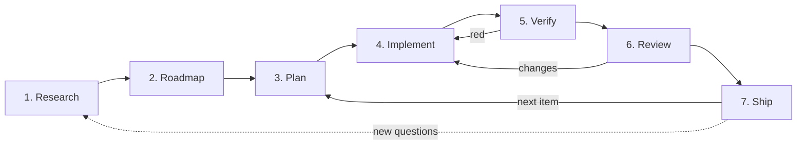

# ADLC — Agentic Development Life Cycle

How this repository is developed: a repeatable lifecycle run by AI agents (Claude Code)
plus deterministic multi-agent workflows, with human approval at the gates that matter.
This is the process; **[HARNESS.md](./HARNESS.md)** is the machinery that runs it, and
**[../CLAUDE.md](../CLAUDE.md)** is the always-loaded contract every agent obeys.

> This is not theory — it is the exact loop that produced the 2026 research survey and the
> Phase 0/1/2 implementation on PR #7 (155 → 252 tests, every commit CI-green).

## The loop

Each phase has **inputs**, an **agentic mechanism** (which Claude Code primitive does the
work), an **artifact**, and a **gate** (what must be true to advance). Gates marked 🔒 need
explicit human approval; the rest are automated (CI / tests).

---

## 1 · Research

- **Goal:** ground the work in the real state of the art, not model memory.
- **Mechanism:** a deterministic **multi-agent workflow** (`.claude/workflows/opencv-webcam-cv-research.js`, ~58 opus agents) — fan-out domain surveys → deep-read paper cards → **adversarial fact-check** → thematic synthesis. Every claim is web-grounded; inventing a paper/number is forbidden.
- **Artifact:** a cited report + machine-readable findings (`docs/research/`).
- **Gate:** 🔒 human skims the report and picks which findings become work.

## 2 · Roadmap

- **Goal:** turn findings into a prioritized, sequenced backlog.
- **Mechanism:** lead-author agent clusters findings into phases by value/effort/risk and maps each to concrete modules and call-sites in this repo.
- **Artifact:** a phase plan (here: Phase 0 foundation → Phase 1 fixes+sensing → Phase 2 heavy models).
- **Gate:** 🔒 human chooses scope and depth (e.g. "depth first" vs "all seven as lazy scaffolds").

## 3 · Plan

- **Goal:** a concrete, reviewable implementation plan for one roadmap item.
- **Mechanism:** **plan mode** (`EnterPlanMode` / the `Plan` agent) — read the affected code, design the change, list files and tests, name the risks. No edits yet.
- **Artifact:** an `ExitPlanMode` plan + a `TaskCreate` checklist.
- **Gate:** 🔒 human approves the plan (`ExitPlanMode`). Ambiguity → `AskUserQuestion`, never a guess.

## 4 · Implement

- **Goal:** write the change so it satisfies the **golden rules** (see CLAUDE.md).
- **Mechanism:** the main agent, or a `cv-implementer` subagent per independent item (parallelizable, optionally in worktrees). Heavy work that fans out (audits, sweeps, N-way design) is delegated to a workflow.
- **Rules applied here:** lazy heavy imports; additive + config-gated; pure-core logic separated from the model call so it is testable.
- **Artifact:** code + unit tests for the pure core (model mocked/injected) + a `CHANGELOG.md` entry.
- **Gate:** `python -m pytest -q` green locally (torch-free).

## 5 · Verify

- **Goal:** prove the change does what it claims — and be honest about what *cannot* be proven here.
- **Mechanism:** the unit suite (mandatory) + import-safety grep + targeted checks. For heavy models that can't run in this env, verification is explicitly deferred to a GPU/torch box and **labelled as not-yet-validated**. Behavior-level checks use the `/verify` or `/run` skills when an app can actually run.
- **Artifact:** passing suite; a clear statement of what was vs wasn't exercised.
- **Gate:** CI green on the pushed commit (`.github/workflows/ci.yml`). 🔒 Never report "validated" for a forward pass that never ran.

## 6 · Review

- **Goal:** catch correctness bugs and complexity before merge.
- **Mechanism:** adversarial review — the `/code-review` skill or a `cv-reviewer` subagent prompted to *refute*, checking the golden rules (lazy imports? defaults unchanged? pure core tested? honest claims?). For deep audits, a review **workflow**: dimensions → find → adversarially verify each finding by a majority vote before it counts.
- **Artifact:** review findings; fixes applied or consciously deferred.
- **Gate:** 🔒 human review on the PR; reviewer comments handled (fix, or explain why not).

## 7 · Ship

- **Goal:** land the change and set up the next loop.
- **Mechanism:** conventional-commit → push to the feature branch → **draft PR** → optional `subscribe_pr_activity` to autofix CI / answer review events until the PR is merged or closed.
- **Artifact:** a merged/мergeable PR; updated `CHANGELOG.md`.
- **Gate:** 🔒 human merge. Then return to **Plan** for the next backlog item (or to **Research** if new questions surfaced).

---

## Agent roles

| Role | Primitive | Responsibility |
|------|-----------|----------------|
| **Orchestrator** | main Claude Code loop | drives the lifecycle, owns the task list, talks to the human |
| **Researcher** | research workflow / `cv-researcher` agent | web-grounded surveys; no invented sources |
| **Planner** | `Plan` agent / plan mode | design before edits |
| **Implementer** | `cv-implementer` agent | one roadmap item, golden-rules-compliant, tested |
| **Reviewer** | `cv-reviewer` agent / `/code-review` | adversarial correctness + invariant checks |
| **Workflow** | `Workflow` tool | deterministic fan-out/verify/synthesize for scale |

See `.claude/agents/` for the implementer/reviewer/researcher definitions.

## Principles

- **Web-ground research; mock the models in tests.** Truth comes from sources and the
  suite, not memory.
- **Adversarial by default.** Findings and risky claims are verified by an independent
  agent prompted to refute, not to agree.
- **Honesty over completeness.** "Wired but not inference-validated" is a first-class,
  required status. Never inflate.
- **Small, green, additive commits.** Every commit keeps CI green and changes nothing by
  default.
- **Humans hold the 🔒 gates.** Scope, plans, reviews, and merges are approved by a person;
  everything between them is automated.

## Quick reference — phase → primitive

| Phase | Primitive(s) |
|-------|--------------|
| Research | `Workflow` (research script), `WebSearch`/`WebFetch`, `deep-research` skill |
| Roadmap | lead-author agent, `AskUserQuestion` |
| Plan | `EnterPlanMode`/`ExitPlanMode`, `Plan` agent, `TaskCreate` |
| Implement | main loop / `cv-implementer` agent, `/workflow` for scale, worktree isolation |
| Verify | `pytest`, import-safety grep, `/verify`, `/run`, CI |
| Review | `/code-review`, `cv-reviewer` agent, review `Workflow` |
| Ship | git + draft PR, `subscribe_pr_activity` |
